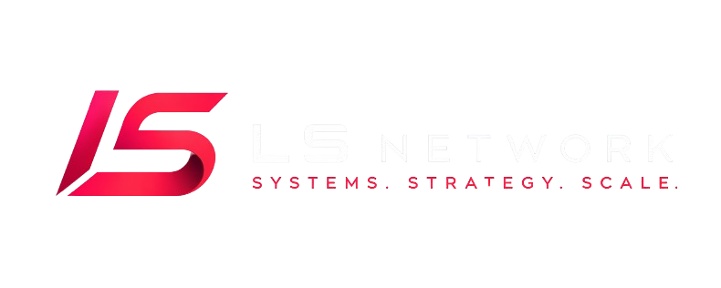

<p align="center">
  
</p>

<p align="center">
  
</p>

<p align="center">
  <strong><code>systems / strategy / scale</code></strong>
</p>

<p align="center">
  <a href="https://lshub.pro">
    
  </a>
  <a href="https://lshub.pro/stoic">
    
  </a>
  <a href="https://github.com/4Stoic">
    
  </a>
</p>

<br>

<p align="center">
  
</p>

<p align="center">
  clean interfaces · backend logic · discord tools · automation
</p>

---

### Stack

<p align="center">
  
</p>

```txt
frontend   react / vite / tailwind
backend    node.js / python / sql
tools      git / github / vscode / powershell
now        building LS systems
