  

  

  <strong><code>systems / strategy / scale</code></strong>

  
  
  

  

  

  

---

### Systems Stack

  

  

  

---

  <strong><code>activity</code></strong>

  

  

  LS Network · systems / automation / operations

