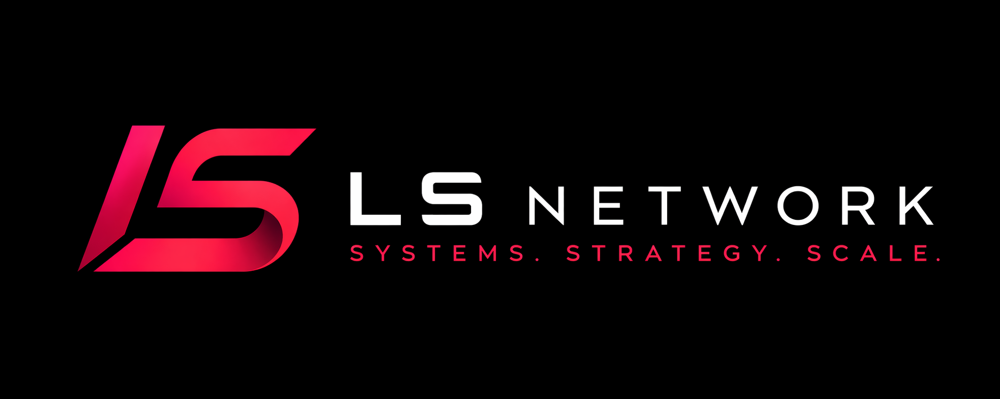

<p align="center">
  
</p>

<p align="center">
  
</p>

<p align="center">
  
</p>

<p align="center">
  <a href="https://lshub.pro"></a>
  <a href="https://lshub.pro/stoic"></a>
  <a href="https://github.com/4Stoic"></a>
</p>

```txt
stoic@ls:~$ whoami
4Stoic

stoic@ls:~$ focus
code / systems / automation

stoic@ls:~$ stack
python / typescript / javascript
react / node.js / sql
```

I build clean interfaces, backend logic, Discord tools, automation, and small systems.

---

### Stack

<p align="center">
  
</p>

```txt
frontend   react / vite / tailwind
backend    node.js / python / sql
tools      git / github / vscode / powershell
now        building LS systems
```

<p align="center">
  
</p>

---

<p align="center">
  
</p>

<p align="center">
  
</p>
